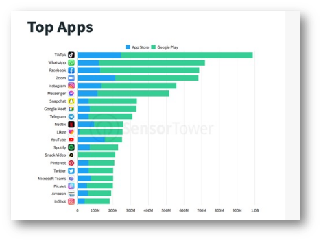

# Курсовая работа

# Введение

Смартфон, на сегодняшний день, есть практически у каждого человека всех возрастных категорий. Как следствие, есть потребность удовлетворять требования широкой аудитории. Это касается как развлекательных приложений: игр, викторин, так и социальных и профессиональных приложений: мессенджеры, трекеры задач, медиа-редакторы.

По данным аналитической компании SensorTower, за 2020 год количество постоянных пользователей отдельных мобильных приложений превышало отметку в один миллиард.

> > Рисунок  1. Распределение пользователей по приложениям

Как видно из графика, наибольшей популярностью пользуются социальные сети и приложения для видеоконференций.

По данным той же компании, за 2020 год общая доля приложений по сферам деятельности также в целом возросла.

> Рисунок  2. Изменение размера аудитории приложений по группам

Все смартфоны в большинстве случаев работают на одной из двух популярных операционных систем: Android и iOS. Их дистрибьюторами, соответственно, являются компании Google и Apple.

Смартфоны на базе Android имеют широкое распространение среди пользователей ввиду широкого ассортимента выбора девайсов и низкого ценового порога входа, а относительно нестрогие правила для создания приложений позволяют разработчикам запросто оказываться на страницах Play Market.

С iOS ситуация немного другая. Система распространяется по проприетарной лицензии и является собственностью компании Apple, которая также занимается и выпуском смартфонов на базе своей операционной системы – iPhone. На момент написания данного материала актуальной версией является iOS 14.5.

Для разработки приложений есть большое число инструментов – как созданных непосредственно Apple в рамках нативных инструментов разработки, так и усилиями разработчиков из open-source или внешних компаний. И, парадоксально, что очень часто сторонние решения и библиотеки оказываются более удобными в промышленной разработке, чем существующие инструменты платформы.

Однако это не означает, что нативные инструменты не должны использоваться. Они постоянно развиваются, и компания регулярно представляет и предоставляет обновления для них.

Основной целью данной курсовой работы является изучение работы с аудио-контентом с помощью нативных инструментов платформы iOS, а также углубление в понимание работы с цифровым аудио.

# Глава 1. Теоретические сведения

## 1.1 Обзор операционной системы iOS

iOS является закрытой операционной системой, разрабатываемой и предоставляемой компанией Apple. Она была представлена на конференции WWDC 29 июня 2007 вместе с выходом первого iPhone и тогда ещё носила название iPhone OS.

Система построена на базе гибридного ядра XNU и микроядер Mach, которые также используются в операционной системе macOS и составляют основу всей идеологии фреймворка Cocoa. На базе iOS также построены другие операционные системы компании: tvOS, audioOS, watchOS, iPadOS. Все они работают с процессорами на архитектуре ARM.

На текущий момент актуальной версией операционной системы является iOS 14.5.

По последним не обновлённым данным аналитического агенства statcounter, распределение по версиям на момент апреля 2021 года было следующее:

> Рисунок  3. Распределение пользователей iOS по версиям

Этот график показывает, что в среднем разработчикам необходимо поддерживать своё приложение на две версии назад, чтобы максимально охватывать потенциальную аудиторию.

Для разработки приложений можно использовать в комбинации языки Swift, Objective-C, C, C++.

## 1.2 Обзор языка Swift

Swift был представлен компанией Apple в 2014 году. Он стал заменой Objective-C в качестве основного языка разработки. Его исходный код открыт и доступен в репозитории Apple на GitHub.

Нововведения в язык могут предлагаться как самой компанией, так и заинтересованными в этом разработчиками. Происходит это посредством предложений. Каждое такое предложение проходит процесс модерирования, корректировки и подтверждения сообществом и основной командой разработчиков языка. На текущий момент актуальная версия языка – Swift 5.4.

Отличительной особенностью Swift является наличие протоколов. Протоколы позволяют определять интерфейс для типа – его набор методов и свойств. Их можно использовать и в качестве типов, что позволяет использовать в языке парадигму протокол-ориентированного программирования.

Помимо этого, язык также реализует объектно-ориентированный и функциональный подходы к программированию. Swift является языком со строгой неявной типизацией и поддерживает как статическую, так и динамическую диспетчеризацию методов. Также есть возможность рефлексии.

Так как Swift стал заменой Objective-C, в нём имеется обратная совместимость со старым кодом. Достигается это за счёт работы собственного компилятора swiftc, который умеет транслировать код Objective-C и C в соответствующие вызовы на Swift.

## 1.3 Обзор языка Objective-C

Данный язык имеет очень долгую историю, которая уходит ещё в 80-е года прошлого века. С 1996 года он является нативным языком разработки приложений для операционных систем Apple. Он был изначально спроектирован компанией NeXT как надстройка над языком C. Его важными отличительными особенностями являются механизм runtime, динамическая диспетчеризация посредством посылки сообщений, рефлексия и наличие объектов. На его основе построены фреймворки Cocoa, Foundation и другие. Базовым классом является NSObject, который описывает и реализует базовое поведение любого объекта Objective-C. Он и до сих пор используется Apple при разработке новых версий своих операционных систем, хотя всё большее предпочтение всё же отдаётся использованию Swift.

## 1.4 Обзор среды разработки Xcode

Xcode – это интегрированная среда разработки, разрабатываемая и поставляемая компанией Apple. Она содержит все необходимые инструменты, которые могут понадобиться разработчикам в процессе написания кода, отладки программы и дистрибуции на платформу.

Среда разработки позволяет создавать программное обеспечение для всех операционных систем Apple. Доступна только на macOS и распространяется бесплатно через магазин приложений AppStore.

Для тестирования написанных программ доступны симуляторы устройств: iPhone, iPad, AppleTV, Watch. Также можно подключать реальные девайсы через порт lightning или type-c.

Для отладки предусмотрен набор специальных утилит – Instruments. Данные утилиты позволяют отслеживать уровень потребления энергии, производительность, работу с памятью, сетевые запросы и т.д.

Для поддержания процесса разработки имеется встроенная поддержка Git репозиториев. Процессы сборки приложений можно модифицировать посредством добавления скриптов на языке bash в отдельную фазу.

## 1.5 Swift Package Manager

SPM – это менеджер зависимостей, который является частью языка Swift. По идее он должен стать заменой популярному инструменту управления зависимостями – Cocoapods и чуть менее популярному – Carthage.

Данный менеджер зависимостей был представлен в 2016 году вместе с выпуском Swift 3.0. В его основе лежат понятия модулей и пакетов. Модули представляют собой единое образование кода, способное решать конкретную задачу и быть переиспользуемым в другом коде. Модули объединяются в пакеты, которые занимаются распределением исходного кода в различные целевые сборки – таргеты. Каждый таргет является конечным продуктом – библиотекой или полноценным исполняемым файлом.

SPM-зависимости предоставляются в качестве Git репозиториев, а их добавление в проект интегрировано в Xcode. Создать собственный SPM-пакет может любой разработчик.

## 1.6 AppStore

Приложения на iOS можно скачать только через официальный магазин приложений AppStore. Для публикации там собственного приложения необходимо приобрести подписку на сертификат разработчика и пройти процесс модерации приложения.

## 1.7 Основы разработки под iOS

Для создания собственных приложений разработчикам предоставляется в использование пакет iOS SDK, который включает в себя основные библиотеки для работы с отображениями, анимацией, сетью, многопоточностью и другими возможностями девайсов.

Каждое приложение представляет собой отдельный проект Xcode. Основной исполняемый файл проекта – файл с расширением .xcodeproj, который содержит и реализует информацию об актуальном состоянии среды разработки – открытые файлы, внесённые изменения, автодополнения.. Рядом с ним находится папка с исходным кодом и ресурсами, которые необходимы приложению для полноценной работы.

> Рисунок  4. Вид директории с проектом

В ресурсных файлах обязательным является файл Info.plist, который является словарём ключ-значение. Он хранит основную информацию о приложении: номер сборки, имя, требуемые разрешения в системе и др..

> Рисунок  5. Пример файла Info.plist

> Рисунок  6. Пример файла исходного кода

Файлы исходного кода на языке Swift имеют расширение .swift. Они содержат инструкции, которые компилируются в исполняемые последовательности в процессе сборки приложения.

Очень важная часть любого iOS приложения – это UI. Для создания интерфейса у разработчиков есть на выбор два фреймворка: UIKit и SwiftUI.

## 1.8 UIKit

Данный фреймворк появился вместе с iOS и является часть более глобального – Cocoa. Он предоставляет уже определённые типы, которые можно использовать для построения пользовательского интерфейса приложения. Это такие, как UIView, UIViewController, UIControl и другие.

Также он определяет и базовую архитектуру, по которой выстраивается дальнейшее взаимодействие UI-элементов. Это касается жизненного цикла, механизма responder-chain, autolayout и многих других механизмов. Все объекты в UIKit унаследованы от NSObject и исходные коды в основном написаны на Objective-C.

Интерфейс с UIKit можно выстраивать несколькими способами. Первый – это визуально через .xib файлы. Данный подход имеет преимущество в наглядности: разработчик может заранее оценить получаемые результат и, соответственно, быстрее внести исправления в случае необходимости.

Файл .xib представляет собой обычный .xml файл, который имеет специальную разметку и используется в инициализаторе UIViewController.

> Рисунок  7. Прототип инициализатора через .xib файл

> Рисунок  8. Пример применения .xib для создания интерфейса

## 1.9 SwiftUI

Фреймворк был представлен в 2019 году на конференции WWDC и был заявлен как замена UIKit на Swift. Он предоставляет полностью новый декларативный подход к реализации пользовательских интерфейсов. Каждый UI-элемент представлен структурой, а не классом. Это позволяет определять независимые элементы и явно указывать между ними без лишних side-effects. Фреймворк тесно работает с Combine. Это нативное решение Apple на тему реактивного программирования. Его использование позволяет строить отзывчивые интерфейсы без написания большого количества шаблонного кода. Также в SwiftUI есть возможность живого превью. То есть проверки работоспособности написанного кода в режиме реального времени и без необходимости сборки проекта и запуска компилятора каждый раз. Ограничением для использования данного фреймворка является совместимость только с версиями iOS 13+.

> Рисунок  9. Пример применения SwiftUI для создания интерфейса

# Глава 2. Предметная область

## 2.1 Анализ существующих приложений

На рынке мобильных приложений существует достаточно большое количество решений для создания и работы с медиа контентом. Существует как профессиональные решения, так и любительские. Аудитория таких приложений, в основном, представлена людьми из творческих сфер деятельности.

Профессиональные приложения являются платными и предоставляют широкий функционал, который закрывает все потребности, возникающие в процессе работы.

**Logic** **Pro** – это платная утилита для профессиональной работы с аудио. Разрабатывается компанией Apple. Основное приложение доступно на платформе macOS.

> Рисунок  10. Logic Pro в App Store

Основным преимуществом данного приложения является полная интеграция с ресурсами устройства, из-за чего оно обладает высокими показателями производительности. На iOS для него есть приложение-компаньон Logic Remote, которое предоставляет функционал MIDI-клавиатуры, станции эффектов и многого другого.

> Рисунок  11. Приложение-компаньон для iOS

**GarageBand** – программа для создания и редактирования аудио, ориентированная на любителей и полупрофессиональных пользователей. Также разрабатывается Apple и распространяется бесплатно. Доступна на платформах iOS, iPadOS, macOS.

> Рисунок  12. GarageBand в App Store

**Voloco** – приложение для записи и редактирования аудио. Условно бесплатное, обладает достаточно широким функционалом в базовой версии. Пользователь может записывать свой голос и обрабатывать его с помощью библиотеки эффектов, обрезать, сливать с другими дорожками. Есть возможность выставления на фон готового трека. Также пользователи могут делиться своими работами друг с другом во внутренней сети.

> Рисунок  13. Voloco в App Store

## 2.2 Предметная область

Для начала стоит вспомнить понятие волны. **Волна** – представляет собой некоторое возмущение окружающей среды. **Возмущением** на бытовом уровне может быть названо что-либо, что может изменить направление и состояние окружающей среды. **Окружающая среда** – это проводник, который распространяет волны. Проводником может служить любая материя – вода, газ, твёрдое вещество. При этом проводник не является источником волны, он только лишь доставляет её через себя.

> Рисунок  14. График sin(x)

График волны может быть представлен с помощью функции вроде $sin(x)$. Соответственно, волна имеет такие характеристики, как период и амплитуда. Волны могут отличаться по своей природе. Бывают механические волны, электромагнитные, волны материи.

Механические волны, в свою очередь, бывают поперечными и продольными. Поперечные волны распространяются перпендикулярно своему направлению. Таким образом работают электромагнитные волны – свет, радиоволны. Продольные волны распространяются параллельно своему направлению. Это, например, звуковые волны.

> Рисунок  15. Виды волн

Звуковая волна является механической. Она способна распространяться как в газах и жидкостях, так и в твёрдом материале. При этом в последнем её скорость распространения значительно выше из-за меньшего расстояния между частицами вещества. В твёрдом веществе звук может распространяться также в виде поперечной волны, в других средах – только в виде продольной.

> Рисунок  16. Поведение частиц в продольной волне

Звук, распространяясь в воздухе, создаёт области с высоким и низким давлением. Или области компрессии (конденсации) и разряжения. Собственно, это и есть звуковая волна. Порождается она **вибрациями** – механическими колебаниями любого твёрдого тела.

Распространение звука характеризуется скоростью. В воздухе величина скорости распространения приблизительно равна .

Частота распространения звука равна количеству пар зон компрессии и разряжения за одну секунду. Чем выше частота, тем выше звук, который мы слышим и наоборот. В обычном случае звуковая волна не остаётся продолжительное время с одной частотой, так как всегда есть место внешним факторам, из-за которых появляются другие частоты. Это называется **шумом** или **обертонами**.

Человек воспринимает звук через ушные органы. Звуковые волны, попадая на мембрану, транслируются в сигналы в мозг. Примерно так же работают и микрофоны – устройства для записи звука. Там мембрана соединена с катушкой, которая может двигаться вдоль магнита. Мембрана улавливает поступающие звуковые волны и двигает катушку, тем самым порождая импульсы, которые далее могут быть транслированы в цифровое представление.

Для оцифровывания звука используется **импульсно-кодовая модуляция**. А сам процесс называется **сэмплированием**.

> Рисунок  17. Дискретизация звука

Электрические импульсы поступают в виде непрерывного сигнала, который необходимо перевести в дискретное представление. Модуляция подразумевает выделение значений этой функции на равных промежутках времени. Линейная кодовая модуляция – это форма модуляции, в которой значения функции звука записывается в относительных значениях. За базовое значение берётся экстремум функции звука на всём её продолжении. Каждое захваченное значение функции звука называется **сэмплом**. Количество записанных сэмплов за одну секунду называется **частотой сэмплирования**. Величина частоты сэмплирования определяет конечное качество звука – то количество информации, которое будет записано и доступно к воспроизведению. Измеряется в Герцах (). Величина сэмпла представляется в относительной величине. Количество чисел, используемых в представлении значения сэмпла, называется **глубиной бита**. Произведение частоты сэмплирования и глубины бита называется частотой бита или **битрейтом**. Более высокий битрейт соответствует более качественному звуку.

Теорема Котельникова определяет значение частоты сэмплирования, достаточное для воспроизведения звука без потерь. Согласно ей, для записи звука без потерь необходимо делать это с частотой сэмплирования, которая больше частоты оригинального звука в два раза.

> Рисунок  18. Сэмплирование

Например, человек может воспринимать звуки в диапазоне частот от 20 Hz до 20000 Hz. Соответственно, высококачественный звук имеет частоту сэмплирования 44100 Hz. Дополнительный диапазон в 4100 Hz связан с историческими причинами появления стандарта. [1, 8с.]

Аудиофайлы представлены различными форматами. Отличие между форматами в том, как они работают с сэмплами. Многие из форматов применяют сжатие к данным для уменьшения размера получаемых файлов. Это применимо потому, что в большинстве случаев аппаратура, используемая для воспроизведения аудио, не способна передать все данные, которые были сэмплированы и такие потери в качестве неотличимы. Очевидно, что применение алгоритмов сжатия приводит к окончательной потере части данных и невозможности их восстановления.

Аудио-форматы могут работать с несколькими аудио-потоками. Каждый поток представляется последовательностью сэмплов. **Кадры** представляют потоки сэмплов в каждый конкретный момент времени. Количество потоков, объединяемых в кадре, определяет и тип аудио. Например, в случае одного потока это моно-звук, в случае двух – стерео. Несколько потоков, объединяемых в один, называются **пересекающимися**.

## 2.3 Существующие инструменты в Cocoa

> Рисунок  19. Стэк аудио в системе Apple

Apple предоставляет широкий набор инструментов для работы с аудио. Это касается как низкоуровневых фреймворков вроде Core Audio, AudioToolbox, API которых написан на чистом C, так и AVFoundation, который в большей степени представлен в Objective-C.

Аудиофайл представляется структурой AudioStreamBasicDescription на языке C, которая содержит все необходимые метаданные для воспроизведения и работы с файлом.

> Рисунок  20. Структура аудиофайла в AudioToolbox

Но в более высокоуровневых инструментах нет необходимости работать с этой структурой напрямую. Также все инструменты в стандартном режиме работают с форматом аудио .caf (Core Audio Format). Это контейнерный формат, который был разработан Apple в 2005 году. Он не ограничен в размерах файла и, теоретически, может хранить сотни лет аудио-контента. [2, 14с.]

# Глава 3. Разработка приложения

## 3.1 Выявление требований к приложению

Основным требованием является возможность записи звука, через принимающий источник устройства – микрофон. Также необходимо обеспечить сохранение полученного файла в файловой системе устройства, его дальнейшее воспроизведение и наложение эффектов.

## 3.2 Определение средств для реализации

Для работы с аудио используется фреймворк AVFoundation. Он предоставляет большое количество инструментов с высоким уровнем абстракции.  В частности – тип AVAudioEngine, который позволяет реализовывать обработку аудио-потока в режиме реального времени. Внутри этот класс работает с ориентированным графом, где каждый узел – это обработчик, выполняющий конкретные действия с передаваемым в него аудио-потоком. На базовом уровне эти узлы можно поделить на несколько групп: принимающие, испускающие, микшеры и посредники.

Принимающие узлы представлены классом AVAudioInputNode. Они соединяются с принимающим портом устройства и ловят с него входящий поток аудио. По умолчанию у объекта класса AVAudioEngine есть один принимающий узел, который автоматически подключается к микрофону девайса.

Испускающие узлы представлены классом AVAudioOutputNode. Соединяются с выходящим портом устройства и передают на него принимаемый поток. В AVAudioEngine также по умолчанию есть один испускающий узел, который автоматически подключается к динамику устройства.

Узлы AVAudioMixerNode могут принимать несколько потоков аудио. Они являются промежуточными. По умолчанию у объекта AVAudioEngine есть один микшер – mainMixerNode, который автоматически подключается к исходящему узлу объекта.

Все другие промежуточные узлы являются обработчиками и могут вносить какие-либо изменения в проходящий через них поток аудио в режиме реального времени. Такие типы наследуются от базового класса AVAudioUnit. В частности, это такие типы, как AVAudioUnitEQ, AVAudioUnitDistortion, AVAudioUnitReverb и другие.

Сам аудиофайл представлен классом AVAudioFile. Он является обёрткой над структурой и предоставляет удобные интерфейсы для работы непосредственно с файлом.

Помимо примитивной обработки в режиме реального времени, AVAudioEngine может производить оффлайн-рендеринг (то есть выводить всю работу на фоновый поток и без задействования портов устройства). А также обрабатывать 3D аудио. Последняя особенность нашла широкое применение с выходом iOS 13 на наушниках AirPods Pro.

В приложении была реализована только базовая обработка и запись без оффлайн-рендеринга.

## 3.3 Построение UI

> Рисунок  21. Диаграмма связей в MVVM

Так как основной акцент работы пришёлся на изучение инструментов работы с аудио, UI остался достаточно примитивным. За основу была взята архитектура MVVM + Coordinator.

Чистый шаблон MVVM представляет из себя набор Model, View и ViewModel. Model представляет бизнес-логику приложения – ключевые компоненты, данные, работа с сетью и ресурсами устройства. View отвечает за построение интерфейса и работает только с UI-фреймворком. ViewModel является посредником и занимается трансляцией сырых данных из Model в пригодную для отображения форму и наоборот. Причём, ViewModel не знает ничего о View, которая её использует и обычно закрыта для последней протоколом. В свою очередь, View может использовать несколько ViewModel различных типов для реализации работы интерфейса. Взаимодействие между объектами происходит посредством биндинга связей.

Использование данного подхода позволяет сильнее разделить ответственности между объектами, чем это можно сделать, используя стандартный шаблон MVC.

Применение шаблона Coordinator позволяет сконцентрировать всю логику по навигации между экранами в одном месте. Это, в конечном счёте, делает отдельные экраны переиспользуемыми и легкозаменяемыми. Применительно к шаблону MVVM, знанием о Coordinator обладает только объект ViewModel.

По сложившейся традиции, данный шаблон не обходится без использования реактивных фреймворков. На данный момент в iOS есть три популярных решения: RxSwift, ReactiveSwift и Combine. Для написания приложения был выбран фреймворк ReactiveSwift ввиду необходимости его изучения вне рамок данной курсовой работы.

Само понимание реактивного программирования (в рамках ReactiveSwift) основано на понятии последовательности событий. Каждое событие может иметь одно из четырёх состояний:

- Состояние значения
- Состояние ошибки
- Состояние завершения
- Состояние прекращения

Эти последовательности могут кем-то испускаться и кем-то получаться. Объекты, испускающие последовательности, называются сигналами. Объекты, принимающие последовательности, называются обозревателями. Также важным понятием является время жизни обозревателя (или время обозревания последовательности), а также события, приводящие к завершению обозревания. Так, события с состоянием значения являются нормальными и не приводят к завершению обозревания. Получая такое событие, обозреватель может совершить какое-либо действие, после которого будет ожидать дальнейшие события. Все остальные состояния приводят к тому, что, после их получения, обозреватель перестаёт получать все дальнейшие события от данного сигнала.

Важной особенностью, которая отличает ReactiveSwift от других реактивных фреймворков, является наличие понятий «холодных» сигналов и «горячих» сигналов. Холодные сигналы испускают последовательности событий только по запросу, а горячие – всегда, когда есть объекты-обозреватели, подписанные на них. Эти типы сигналов, соответственно, представлены типами SignalProducer и Signal.

Также у данного фреймворка есть продолжение для UI в виде ReactiveCocoa, который добавляет поддержку реактивных функций к стандартным элементам библиотеки UIKit. Доступны они через обращение к свойству reactive.

## 3.4 Хранение данных

В качестве инструмента для работы с хранимыми данными – параметрами для изменения аудио-файлов - был использован фреймворк CoreData. Он поставляется в стандартном iOS SDK и представляет собой удобный инструмент для работы с данными. Он представляет эти данные в виде графа объектов и в целом соответствует концептам объектно-ориентированного программирования в этом плане. В качестве внутренней системы для хранения может выступать как база данных, вроде SQLite, так и просто файловая система.

> Рисунок  22. Диаграмма стэка CoreData (iOS 10+)

В основе работы с CoreData лежит стек из нескольких классов. NSManagedObjectModel описывает набор объектов (таблицы в SQL-решении), которые представляют хранимые данные. NSManagedObjectContext является своего рода транзакцией в базе данных. Он позволяет вносить изменения, сохранять и отменять их. NSPersistentStoreCoordinator синхронизирует несколько контекстов в оконечный результат. NSPersistentCointainer был добавлен в iOS 10 для упрощения работы с этим стеком.

По умолчанию CoreData предполагает работу в одном потоке. Это означает, что для каждого потока, в случае многопоточного приложения, необходимо иметь отдельный объект NSManagedContext. Передача контекстов и получаемых на них объектов между потоками может привести к ошибкам работы с данными.

Для работы с файловой системой устройства используется стандартный класс FileManager.

## 3.5 Корректирование кода

В качестве инструмента для автоматической корректировки кода был использован фреймворк SwiftLint. Он поставляется в различных вариантах: как один из пакетов в системе зависимостей brew, как пакет в SPM и Cocoapods.

> Рисунок  23. Пример скрипта запуска SwiftLint

В проекте утилита была использована как консольная команда. Данный скрипт на языке bash добавляется в фазу сборки проекта и отрабатывает каждый раз при компиляции.

Использование подобных инструментов находит широкое применение в более масштабных проектах и позволяет контролировать общий стиль написания кода и устранять различные неточности, что позволяет в некоторых случаях упрощать разработку.

## 3.6 gitflow

При разработке проекта был применён подход с использованием системы контроля версии Git и разделением веток на основную и побочные. Изменения в основную ветку вносились путём создания pull-request – запросов на изменение из побочных веток. При принятии решения о внесении изменений производится процесс code-review. Код изменённой версии осматривается на наличие ошибок и неточностей и, в случае необходимости, в него вносятся изменения.

Так как проект разрабатывался только мной, то и процесс code-review также проводил только я. Это нормальная практика, которая позволяет контролировать себя и не отклоняться от установленных правил написания кода.

## 3.7 Kanban

> Рисунок  24. Пример Kanban

Kanban является подходом для управления задачами. Он представляет из себя обычную доску, разделённую на несколько колонок. Каждая колонка называется соответственно состоянию задачи. Например, «в производстве», «сделано», «сделать» и т.д. Задачи представлены стикерами.

Подход позволяет достаточно просто контролировать процесс выполнения задач, оценивать возможные риски и ставить дальнейшие приоритеты. Может использоваться как для личного планирования, так и для управления работой команды людей.

Для организации данной доски был использован инструмент Notion.

> Рисунок  25. Применение Kanban в Notion

Задачи в процессе выполнения перемещаются между колонками, ознаменовывая тем самым изменение своего текущего статуса.

# Глава 4. Анализ результатов

## 4.1 Оценка реализованного функционала

В процессе разработки приложения был реализован заявленный в требованиях функционал. Каждый проект представлен в виде отдельной папки в файловой системе и объекта в CoreData.

> Рисунок  26. Экран со списком проектов, созданных пользователем

В проекте содержится список всех записанных дорожек, относящихся к этому проекту. Есть возможность добавления новых треков. Нереализованной осталась функция проигрывания всех треков и экспортирования в виде единого файла.

> Рисунок  27. Экран проекта со списком треков

Интерфейс экрана записи имеет отображение графика записанного звука и функциональные кнопки проигрывания, сохранения и удаления. Информация для отрисовки графика берётся из буфера трека.

> Рисунок  28. Экран записи аудио

Редактировать трек можно посредством наложения эффектов эквалайзера, реверберации и искажения. Экран каждого эффекта имеет слайдеры, позволяющие регулировать интенсивность применения эффекта.

> Рисунок  29. Экран редактирования

Для сохранения применённых эффектов пользователю необходимо нажать на кнопку Save. И, так как оффлайн-рендеринг аудио остался нереализованным, пользователю необходимо прослушать полученный результат, чтобы он был сохранён в файл.

# Заключение

В процессе знакомства с инструментами и реализации приложения, я столкнулся с большим количеством трудностей. Самая главная – это недостаток практической информации по работе с типом AVAudioEngine. Например, из-за этого не были реализованы функции оффлайн-рендеринга и экспорта аудио.

Также большое количество API всё ещё тесно связано с C и все вызовы функций на Swift являются ни чем иным как обёрткой и вызовом внутри этих самых функций на C.

Обнаружилось, что у фреймворка AVFoundation есть ещё много функционала, который не так интенсивно используется, но который активно развивается компанией. К тому же, начиная с версии iOS 14.5, Apple выделяют функционал по работе с аудио в отдельный набор классов под фреймворком AVFAudio. Есть большая вероятность того, что на WWDC 2021 они представят что-то новое в этом направлении.

Я вижу потенциал в развитии идеи, которая находится в основе данной курсовой работы, и планирую глубже изучить AVFoundation, CoreAudio и написать приложение с применением уже более современных технологий – SwiftUI и Combine.

# Список использованных источников

1. Christopher L. Bennett. Digital Audio Theory. A Practical Guide. – Taylor & Francis Group, 2020 – 255 с.
2. Chris Adamson, Kevin Avila. Learning Core Audio. A Hands-On Guide to Audio Programming for Mac and iOS – Addison-Wesley, 2012 – 329 с.
3. Apple Inc. The Swift Programming Language. Swift 5.3 Edition – 659 с.
4. Robert C. Seacord. Effective C. An Introduction to Professional C Programming – no starch press, San Francisco, 2020 – 274 с.
5.  – электронные данные https://developer.apple.com
6.  – электронные данные https://sensortower.com
7.  – электронные данные https://www.apple.com/app-store